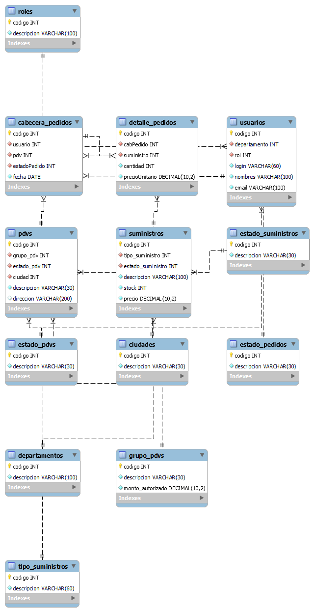

# Documentación Arquitectura de Software
## Sistema de susministros de pedidos - Farmcorp

> **Versión:** 1.0.0  
> **Fecha:** 2026-02-24  
> **Autor:** Área de Tecnología — FarmCorp  
> **Estado:** En desarrollo
---

## Tabla de contenidos 
1. [Descripción General](#1-descripción-general)
2. [Arquitectura del Sistema](#2-arquitectura-del-sistema)
3. [Modelo Entidad–Relación (ERD)](#3-modelo-entidadrelación-erd)
4. [Diccionario de Datos](#4-diccionario-de-datos)
5. [Estándares de Desarrollo](#5-estándares-de-desarrollo)
6. [Documentación de API](#6-documentación-de-api)
7. [Manual de Usuario](#7-manual-de-usuario)
8. [Manual de Administración](#8-manual-de-administración)

## 1. Descripción General

### 1.1 Propósito

El **Sistema de Pedidos de Suministros** permite a los colaboradores de FarmCorp solicitar suministros de oficina y limpieza para los Puntos de Venta (PDVs) activos, respetando el cupo asignado por grupo. El sistema genera un registro en base de datos y notifica al responsable por correo electrónico con el detalle en formato CSV.

### 1.2 Alcance 
| Módulo | Descripción |
|--------|-------------|
| Autenticación | Login mediante Active Directory (LDAP) en producción, login local en pruebas |
| Catálogos | PDVs, tipos de suministro, suministros con precio |
| Pedidos | Creación de pedido con carrito, validación de cupo, generación CSV |
| Notificaciones | Envío de email automático con archivo adjunto |

### 1.3 Usuarios del sistema 
| Rol | Descripción |
|-----|-------------|
| Solicitador | Crea pedidos de suministros para un PDV |
| Aprobador | Revisa y aprueba/rechaza pedidos (futuro) |
| Administrador | Gestión de catálogos y configuración (futuro) |

---

## 2. Arquitectura del Sistema

### 2.1 Diagrama de componentes

---
Hazta el momento no se dispone del frontend para realizar un respectivo diagrama

### 2.2 Stack tecnológico
| Capa | Tecnología | Versión |
|------|-----------|---------|


### 2.3 Estructura de carpetas
```
Sistema_Distribucion_Suministros/
├── supply-backend/               ← API REST Node.js
│   ├── src/
│   │   ├── index.js              ← Punto de entrada Express
│   │   ├── config/
│   │   │   ├── db.js             ← Pool de conexiones MySQL
│   │   │   └── ldap.js           ← Cliente LDAP/AD
│   │   ├── middleware/
│   │   │   └── auth.js           ← Protección de rutas
│   │   └── routes/
│   │       ├── auth.js           ← Login / Logout / /me
│   │       ├── catalogos.js      ← PDVs, suministros, tipos
│   │       └── pedidos.js        ← Crear pedido + CSV + Email
│   ├── .env                      ← Variables de entorno (no en git)
│   ├── .env.example              ← Plantilla de variables
│   └── package.json

```
---
## 3. Modelo Entidad-Relación (ERD)

## 3.1 Diagrama
Para ver el diagrama detallado, haz clic en el enlace: 

[](./Docs/base.png)

## 4. Diccionario de Datos

### 4.1 `tipo_suministros`
| Campo | Tipo | Nulo | Descripción |
|-------|------|------|-------------|
| `codigo` | INT AI PK | NO | Identificador único |
| `descripcion` | VARCHAR(60) | NO | Nombre del tipo (Oficina, Limpieza) |

### 4.2 `estado_suministros`
| Campo | Tipo | Nulo | Descripción |
|-------|------|------|-------------|
| `codigo` | INT AI PK | NO | Identificador único |
| `descripcion` | VARCHAR(30) | NO | Disponible / No Disponible |

### 4.3 `suministros`
| Campo | Tipo | Nulo | Descripción |
|-------|------|------|-------------|
| `codigo` | INT AI PK | NO | Identificador único |
| `tipo_suministro` | INT FK | NO | Ref. `tipo_suministros.codigo` |
| `estado_suministro` | INT FK | NO | Ref. `estado_suministros.codigo` |
| `descripcion` | VARCHAR(100) | NO | Nombre del artículo |
| `stock` | INT | NO | Unidades disponibles |
| `precio` | DECIMAL(10,2) | NO | Precio unitario en USD |

### 4.4 `grupo_pdvs`
| Campo | Tipo | Nulo | Descripción |
|-------|------|------|-------------|
| `codigo` | INT AI PK | NO | Identificador único |
| `descripcion` | VARCHAR(30) | NO | Pequeño / Mediano / Grande |
| `monto_autorizado` | DECIMAL(10,2) | NO | Cupo máximo de pedido en USD |

### 4.5 `ciudades`
| Campo | Tipo | Nulo | Descripción |
|-------|------|------|-------------|
| `codigo` | INT AI PK | NO | Identificador único |
| `descripcion` | VARCHAR(30) | NO | Nombre de la ciudad |

### 4.6 `pdvs`
| Campo | Tipo | Nulo | Descripción |
|-------|------|------|-------------|
| `codigo` | INT AI PK | NO | Identificador único |
| `grupo_pdv` | INT FK | NO | Ref. `grupo_pdvs.codigo` |
| `estado_pdv` | INT FK | NO | Ref. `estado_pdvs.codigo` — 1=Activo |
| `ciudad` | INT FK | NO | Ref. `ciudades.codigo` |
| `descripcion` | VARCHAR(30) | NO | Código/nombre del PDV (ej: FC013) |
| `direccion` | VARCHAR(200) | SÍ | Dirección física |

### 4.7 `departamentos`
| Campo | Tipo | Nulo | Descripción |
|-------|------|------|-------------|
| `codigo` | INT AI PK | NO | Identificador único |
| `descripcion` | VARCHAR(100) | NO | Nombre del departamento |

### 4.8 `roles`
| Campo | Tipo | Nulo | Descripción |
|-------|------|------|-------------|
| `codigo` | INT AI PK | NO | Identificador único |
| `descripcion` | VARCHAR(100) | NO | Solicitador / Aprobador / Administrador |

### 4.9 `usuarios`
| Campo | Tipo | Nulo | Descripción |
|-------|------|------|-------------|
| `codigo` | INT AI PK | NO | Identificador único |
| `departamento` | INT FK | NO | Ref. `departamentos.codigo` |
| `rol` | INT FK | NO | Ref. `roles.codigo` |
| `login` | VARCHAR(60) | NO | Usuario de red (sAMAccountName) |
| `nombres` | VARCHAR(100) | NO | Nombre completo |
| `email` | VARCHAR(100) | NO | Correo corporativo |
| `password` | VARCHAR(255) | SÍ | **Solo entorno TEST.** En producción auth es LDAP |

### 4.10 `cabecera_pedidos`
| Campo | Tipo | Nulo | Descripción |
|-------|------|------|-------------|
| `codigo` | INT AI PK | NO | Identificador único del pedido |
| `usuario` | INT FK | NO | Ref. `usuarios.codigo` |
| `pdv` | INT FK | NO | Ref. `pdvs.codigo` |
| `estadoPedido` | INT FK | NO | Ref. `estado_pedidos.codigo` — inicia en 1 |
| `fecha` | DATE | NO | Fecha de creación del pedido |

### 4.11 `detalle_pedidos`
| Campo | Tipo | Nulo | Descripción |
|-------|------|------|-------------|
| `codigo` | INT AI PK | NO | Identificador único del ítem |
| `cabPedido` | INT FK | NO | Ref. `cabecera_pedidos.codigo` |
| `suministro` | INT FK | NO | Ref. `suministros.codigo` |
| `cantidad` | INT | NO | Unidades solicitadas |
| `precioUnitario` | DECIMAL(10,2) | NO | Precio al momento del pedido |

---
## 5. Estándares de Desarrollo

### 5.1 Convenciones de nomenclatura

### 5.2 Variables de entorno
```
# Entorno de pruebas
AUTH_MODE=local
DB_HOST=127.0.0.1

# Entorno de producción
AUTH_MODE=ldap
DB_HOST=IP_SERVIDOR_PROD
```

